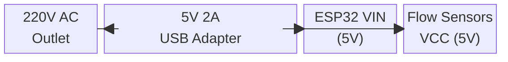
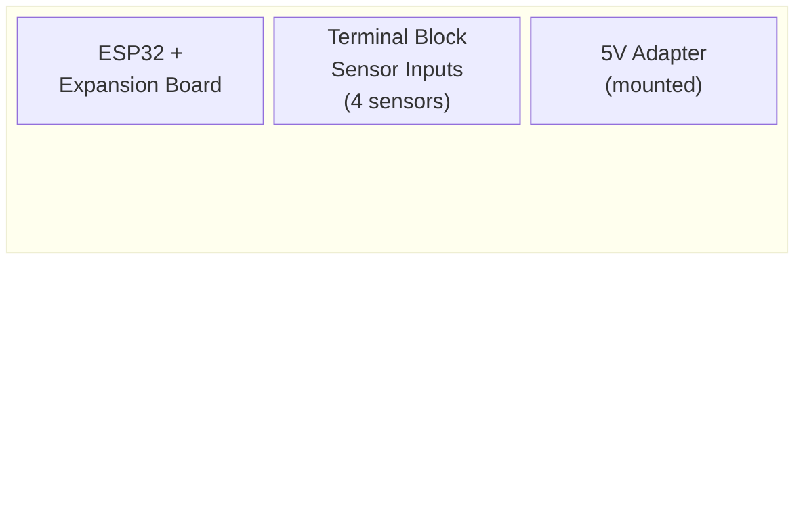

# Block Diagram — Water Meter with Leak Detection (ESP32 → Firebase → RPi)

## System Block Diagram

> Mermaid-based diagram (SVG export removed; source below)

<details>
<summary><b> Mermaid Source</b> (click to expand)</summary>


</details>

---

## Pin Connections (ESP32 38-Pin with Expansion Board)

| Component | ESP32 Pin | Expansion Board | Notes |
|-----------|-----------|-----------------|-------|
| **Flow Sensor 1 — Inlet** | GPIO 26 | Screw terminal 1 | Direct connection, no pull-up needed |
| **Flow Sensor 2 — Fixture 1 (Bidet)** | GPIO 25 | Screw terminal 2 | Direct connection |
| **Flow Sensor 3 — Fixture 2 (Kitchen)** | GPIO 33 | Screw terminal 3 | Direct connection |
| **Flow Sensor 4 — Fixture 3 (Bathroom Shower)** | GPIO 32 | Screw terminal 4 | Direct connection |

---

## Wiring Diagram (Simplified)

```
ESP32 38-Pin Expansion Board
┌─────────────────────────────────────────────────────┐
│  [26] ──────┬── YF-S201 Inlet (Yellow)              │
│  [25] ──────┬── YF-S201 Fixture 1 (Yellow)          │
│  [33] ──────┬── YF-S201 Fixture 2 (Yellow)          │
│  [32] ──────┬── YF-S201 Fixture 3 (Yellow)          │
│                                                     │
│  5V  ──────┬── YF-S201 VCC (Red wires)             │
│  GND ──────┬── All sensor GND (Black wires)        │
└─────────────────────────────────────────────────────┘
```

---

## Sensor Wiring (YF-S201)

```
YF-S201 Flow Sensor
┌──────────────┐
│              │
│  Red   ─────┼──── 5V (VIN from ESP32/Expansion Board)
│  Black ─────┼──── GND
│  Yellow ────┼──── GPIO (26, 25, 33, 32) — direct connection
│              │
│  [Flow →]    │   ← Arrow indicates water flow direction
└──────────────┘
```

> **Important:** The arrow on the sensor body MUST point in the direction of water flow. Installing it backwards will give no readings.

---

## Power Distribution

> Mermaid-based diagram (SVG export removed; source below)

<details>
<summary><b> Mermaid Source</b> (click to expand)</summary>



</details>

> **Note:** The 12V solenoid valve power supply and LM2596 step-down regulator have been removed from this configuration. Check valves provide backflow prevention; automatic shutoff via solenoid valves is not included in this version.

---

## Component Layout (Enclosure)

> Mermaid-based diagram (SVG export removed; source below)

<details>
<summary><b> Mermaid Source</b> (click to expand)</summary>



</details>

> **Enclosure:** Use an ABS project box (200×120×70mm) with cable glands for waterproof sensor cable entry.

---

## Pinout Reference (ESP32 38-Pin)

```
                   ┌─────────────┐
             EN ──┤ 1         38├── VBAT
           GPIO36─┤ 2         37├── GPIO23
           GPIO39─┤ 3         36├── GPIO22
           GPIO34─┤ 4  E   P  35├── TXD0
           GPIO35─┤ 5  S   3  34├── RXD0
           GPIO32─┤ 6   P   2  33├── GPIO21
           GPIO33─┤ 7   3   1  32├── GPIO19
           GPIO25─┤ 8   8      31├── GPIO18
           GPIO26─┤ 9          30├── GPIO5
           GPIO27─┤10          29├── GPIO17 (TXD2)
           GPIO14─┤11          28├── GPIO16 (RXD2)
           GPIO12─┤12          27├── GPIO4
           GPIO13─┤13          26├── GPIO0 (BOOT)
              GND ─┤14          25├── GPIO2 (LED)
           GPIO15─┤15          24├── GPIO15
           ───────┤16          23├── ───────
              3.3V ─┤17          22├── ───────
              5V  ─┤18          21├── ───────
              GND ─┤19          20├── ───────
                   └─────────────┘
```

> Flow sensors on **GPIO 26, 25, 33, 32** — direct connection, no pull-up resistors needed.