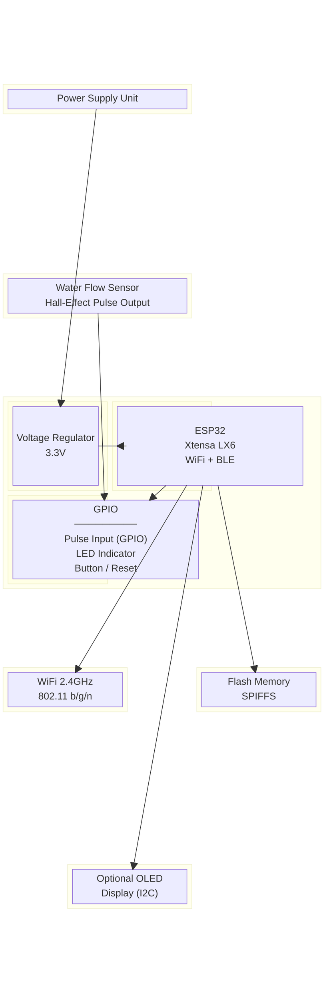
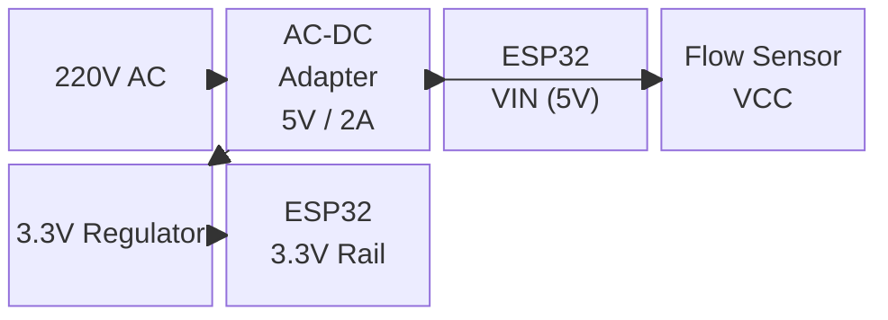

# Block Diagram — Water Meter Hardware

## Hardware Block Diagram

## Pin Connections

| Component       | ESP32 Pin | Notes                        |
|-----------------|-----------|------------------------------|
| Flow Sensor Out | GPIO 34   | Pulse input (rising edge)    |
| LED Indicator   | GPIO 2    | Onboard LED / status         |
| Button (Reset)  | EN        | Pull-up to 3.3V              |
| OLED SDA        | GPIO 21   | (Optional) I2C data          |
| OLED SCL        | GPIO 22   | (Optional) I2C clock         |
| VCC (Sensor)    | 5V / 3.3V | Per sensor spec              |
| GND             | GND       | Common ground                |

## Power Supply

## Bill of Materials (Suggested)

| Item                    | Quantity | Notes                  |
|-------------------------|----------|------------------------|
| ESP32 Dev Board         | 1        | Any variant            |
| Water Flow Sensor       | 1        | YF-S201 or similar     |
| 5V / 2A Power Adapter  | 1        | USB or barrel jack     |
| Jumper Wires            | Several  | Female-to-female       |
| Resistors (10kΩ)        | 1-2      | Pull-up if needed      |
| OLED 128x64 (Optional)  | 1        | I2C display            |
