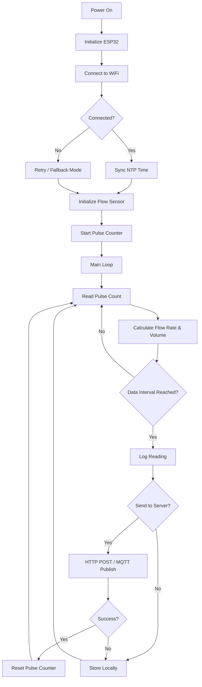
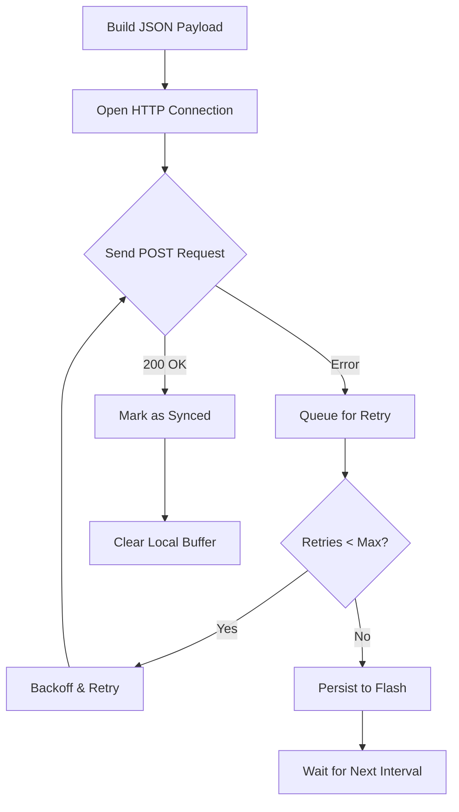

# Flowchart — Water Meter System

## 1. Main System Flow

```mermaid
flowchart TD
    A[Power On] --> B[Initialize ESP32]
    B --> C[Connect to WiFi]
    C --> D{Connected?}
    D -->|Yes| E[Sync NTP Time]
    D -->|No| F[Retry / Fallback Mode]
    E --> G[Initialize Flow Sensor]
    F --> G
    G --> H[Start Pulse Counter]
    H --> I[Main Loop]
    
    I --> J[Read Pulse Count]
    J --> K[Calculate Flow Rate & Volume]
    K --> L{Data Interval Reached?}
    L -->|Yes| M[Log Reading]
    L -->|No| J
    
    M --> N{Send to Server?}
    N -->|Yes| O[HTTP POST / MQTT Publish]
    N -->|No| P[Store Locally]
    O --> Q{Success?}
    Q -->|Yes| R[Reset Pulse Counter]
    Q -->|No| P
    P --> J
    R --> J
```

## 2. Pulse Interrupt Flow

```mermaid
flowchart LR
    A[Sensor Pulse] --> B[ISR Triggered]
    B --> C[Increment Pulse Count]
    C --> D[Debounce Guard]
    D --> E[Return to Main Loop]
```

## 3. Data Upload Flow

```mermaid
flowchart TD
    A[Build JSON Payload] --> B[Open HTTP Connection]
    B --> C{Send POST Request}
    C -->|200 OK| D[Mark as Synced]
    C -->|Error| E[Queue for Retry]
    E --> F{Retries < Max?}
    F -->|Yes| G[Backoff & Retry]
    F -->|No| H[Persist to Flash]
    G --> C
    D --> I[Clear Local Buffer]
    H --> J[Wait for Next Interval]
```
