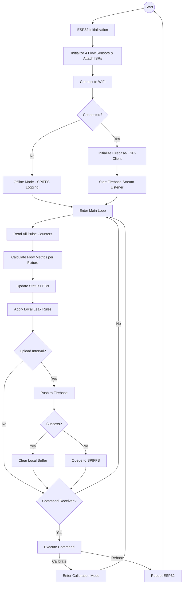
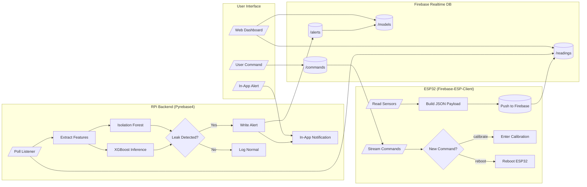
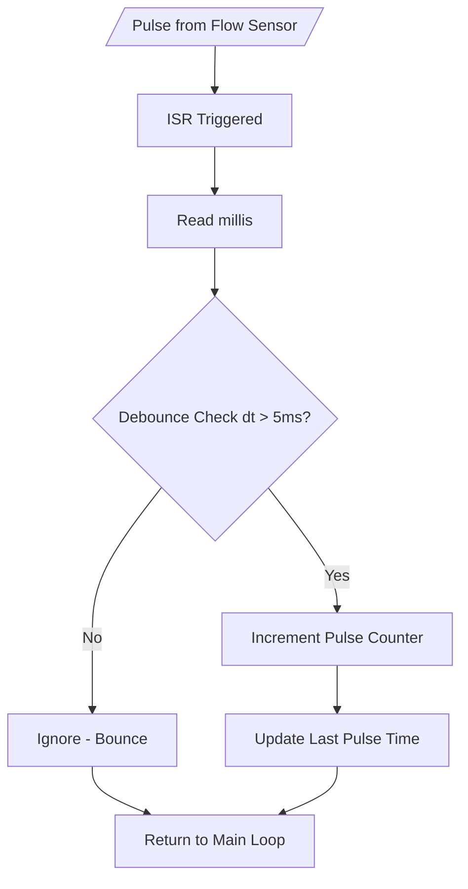
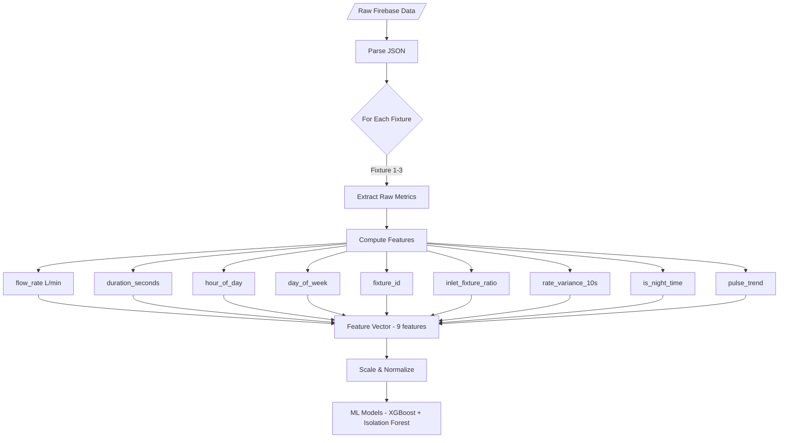
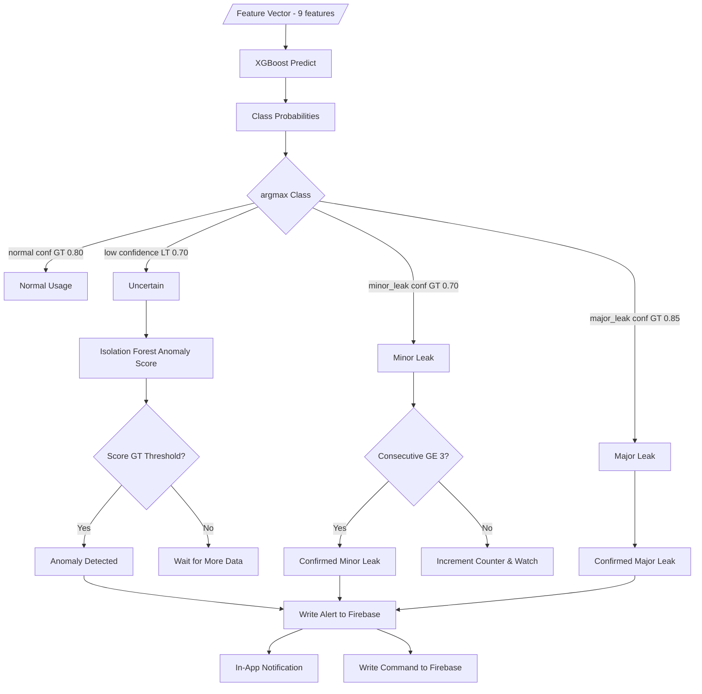
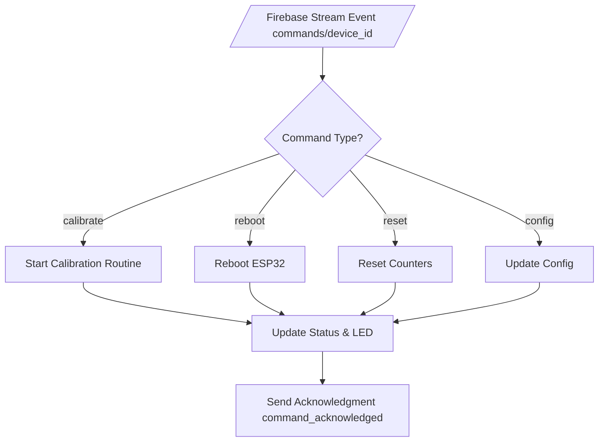
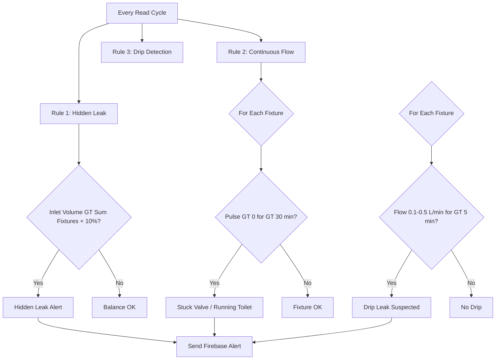

```mermaid
flowchart LR
    %% Physical Layer
    Water[/Water Flow/]:::physical --> Sensor[YF-S201 Flow Sensor]:::physical
    Sensor --> Pulse[/Pulse Signal/]:::physical
    
    %% Firmware Layer
    Pulse --> ISR[ISR Pulse Counter]:::firmware
    ISR --> Debounce[Debounce 5ms]:::firmware
    Debounce --> Calc[Calculate Flow & Volume]:::firmware
    Calc --> LocalRules[Local Leak Rules]:::firmware
    Calc --> FirebaseClient[Firebase-ESP-Client]:::firmware
    LocalRules --> FirebaseClient
    
    %% Cloud Layer
    FirebaseClient -->|HTTPS SSE| Firebase[(Firebase Realtime DB)]:::cloud
    
    %% Backend Layer
    Firebase -->|Poll| Pyrebase[/Pyrebase4 Poll/]:::backend
    Pyrebase --> Features[Feature Extraction]:::backend
    Features --> XGB[XGBoost Inference]:::ml
    Features --> IF[Isolation Forest Anomaly]:::ml
    XGB --> AlertEngine[Alert Engine]:::backend
    IF --> AlertEngine
    AlertEngine --> Notify[In-App Notification]:::user
    
    %% User Layer
    Firebase --> Dashboard[Web Dashboard]:::user
    Firebase -->|Stream| ESP32Cmd[ESP32 Command Stream]:::firmware
    ESP32Cmd --> Handler[Command Handler]:::firmware
    
    classDef physical fill:#e1f5fe,stroke:#0288d1,stroke-width:2px
    classDef firmware fill:#fff3e0,stroke:#f57c00,stroke-width:2px
    classDef cloud fill:#e8f5e9,stroke:#388e3c,stroke-width:2px
    classDef backend fill:#f3e5f5,stroke:#7b1fa2,stroke-width:2px
    classDef ml fill:#fce4ec,stroke:#c62828,stroke-width:2px
    classDef user fill:#fffde7,stroke:#f9a825,stroke-width:2px
```

# Flowchart — Water Meter with Leak Detection (ESP32 → Firebase → RPi Backend)

## 1. Main System Flow (High-Level)

> Mermaid-based diagram (SVG export removed; source below)

<b> Mermaid Source</b> (click to expand)

---

## 2. Firebase Data Flow (ESP32 → Firebase → RPi)

> Mermaid-based diagram (SVG export removed; source below)

<b> Mermaid Source</b> (click to expand)

---

## 3. ESP32 ISR Pulse Processing

> Mermaid-based diagram (SVG export removed; source below)

<b> Mermaid Source</b> (click to expand)

---

## 4. RPi Feature Extraction Pipeline

> Mermaid-based diagram (SVG export removed; source below)

<b> Mermaid Source</b> (click to expand)

---

## 5. ML Inference & Decision Flow

> Mermaid-based diagram (SVG export removed; source below)

<b> Mermaid Source</b> (click to expand)

---

## 6. Firebase Command Execution (ESP32)

> Mermaid-based diagram (SVG export removed; source below)

<b> Mermaid Source</b> (click to expand)

---

## 7. Local Leak Detection Rules (ESP32 Fallback)

> Mermaid-based diagram (SVG export removed; source below)

<b> Mermaid Source</b> (click to expand)

---

## 8. Full System Data Flow

> Mermaid-based diagram (SVG export removed; source below)

<b> Mermaid Source</b> (click to expand)

