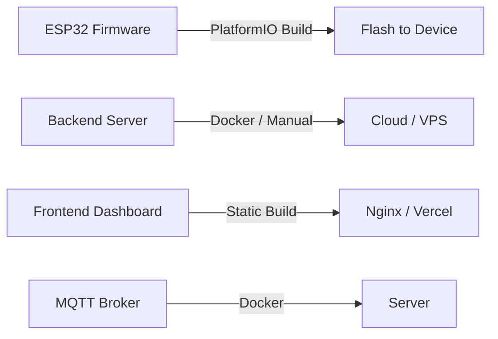

# Technology Stack

## Hardware

| Component         | Technology                        |
|-------------------|-----------------------------------|
| Microcontroller   | ESP32 (Xtensa LX6, WiFi + BLE)   |
| Flow Sensor       | YF-S201 / Hall-effect pulse meter |
| Connectivity      | WiFi 802.11 b/g/n                 |
| Local Storage     | SPIFFS (Flash File System)        |
| Display (Opt.)    | OLED 128x64 (SSD1306, I2C)        |

---

## Firmware

| Layer       | Technology                                         |
|-------------|----------------------------------------------------|
| Framework   | Arduino Framework / ESP-IDF                        |
| Language    | C++ (Arduino)                                      |
| IDE         | Arduino IDE / PlatformIO                           |
| WiFi        | WiFi.h (Arduino Core)                              |
| HTTP Client | HTTPClient.h / AsyncHTTPRequest                    |
| MQTT        | PubSubClient.h / esp-mqtt                          |
| Time        | NTPClient.h / configTime()                         |
| Storage     | SPIFFS.h / LittleFS                                |
| JSON        | ArduinoJson                                        |
| Deep Sleep  | esp_sleep.h (battery optimization)                 |

---

## Backend

| Layer         | Technology Options                         |
|---------------|--------------------------------------------|
| Language      | Node.js / Python / PHP                     |
| Framework     | Express.js / FastAPI / Laravel              |
| Database      | PostgreSQL / MySQL / SQLite / InfluxDB      |
| MQTT Broker   | Mosquitto / EMQX                            |
| API Style     | REST (JSON)                                 |
| Auth          | API Key / JWT                               |
| Hosting       | VPS / Raspberry Pi / Cloud (AWS, GCP)       |

---

## Dashboard / Frontend

| Layer         | Technology           |
|---------------|----------------------|
| Framework     | React / Vue.js       |
| Charts        | Chart.js / ECharts   |
| Styling       | Tailwind CSS / MUI   |
| Real-time     | WebSocket / SSE      |

---

## Communication Protocols

| Protocol | Use Case                    | Port    |
|----------|-----------------------------|---------|
| HTTP     | REST API data submission    | 80/443  |
| MQTT     | Real-time lightweight PubSub| 1883    |
| WebSocket| Live dashboard updates      | 8080    |

---

## Development Tools

| Tool            | Purpose                        |
|-----------------|--------------------------------|
| PlatformIO      | Build & flash firmware         |
| Arduino IDE     | Alternative firmware dev       |
| Postman / curl  | API testing                    |
| Serial Monitor  | Debug ESP32 serial output      |
| Wireshark       | Network debugging              |
| Git             | Version control                |

---

## Deployment

