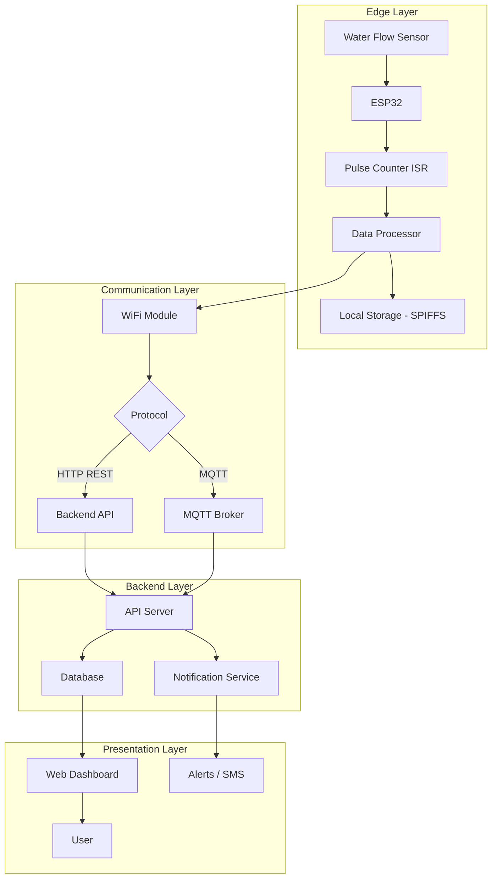

# System Architecture

## Overview

The Water Meter system is an IoT-enabled smart water monitoring solution. It uses an ESP32 microcontroller to read pulses from a water flow sensor, calculate consumption, and transmit data to a backend server for logging and visualization.

## Architecture Diagram



## System Components

### 1. Edge Device (ESP32)
- **Microcontroller** — ESP32 with WiFi + Bluetooth
- **Flow Sensor** — Hall-effect pulse output flow meter
- **Storage** — SPIFFS for local data buffering
- **Connectivity** — WiFi (station mode), MQTT / HTTP

### 2. Communication
- **WiFi** — Connects to local access point
- **Protocol** — HTTP REST or MQTT for data transmission
- **Format** — JSON payloads for structured data exchange

### 3. Backend
- **API Server** — Accepts readings from devices
- **Database** — Stores consumption history per device
- **Notification Service** — Alerts for leaks, high usage, or device offline

### 4. Dashboard
- **Web Interface** — Real-time and historical consumption charts
- **Alerts** — Threshold-based notifications

## Data Flow

```
Sensor → Pulse → ESP32 Counter → Volume Calculation → Local Buffer
    ↓ (every N minutes)
JSON Payload → WiFi → HTTP/MQTT → Backend API → Database
    ↓
Web Dashboard ← Query API ←
```
